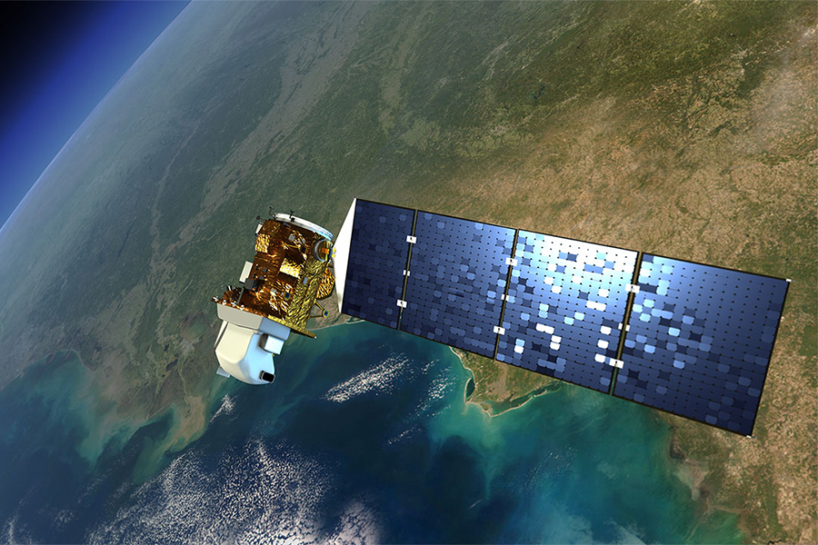

# 🚀 Landsat 7 Satellite Position Estimation with Extended Kalman Filter



This project implements an **Extended Kalman Filter (EKF)** to estimate the **position of the Landsat 7 satellite** based on observation data. The data, extracted from **Google Earth Engine**, contains the satellite's image center positions recorded on **May 5, 2015**.

---

## 📂 Project Overview

Satellite tracking and position estimation are critical for remote sensing missions and Earth observation.  
This Python project leverages **EKF techniques** to fuse noisy position measurements and predict the satellite's orbit with higher precision.

---

## 🛰 Data

- **Source**: Google Earth Engine  
- **Content**: Center position of Landsat 7 images taken on **May 5, 2015**
- **Format**: CSV (`ls7_data_5_10_2015.csv`)

---

## ⚙ How It Works

1. **Input Data**: Reads satellite position data in spherical coordinates (longitude, latitude, timestamp).
2. **Preprocessing**: Converts the data into Cartesian coordinates and calculates orbital parameters.
3. **Extended Kalman Filter**:
   - Initializes the filter using the first few measurements.
   - Predicts and updates the state estimate at each timestamp.
   - Outputs the estimated trajectory.
4. **Visualization**:
   - 3D plot of the real and estimated orbit.
   - Error plots over time for each component.
   - Projection of the trajectory onto a 2D map.

---

## 📊 Outputs

| Plot Type        | Description                                      |
|------------------|--------------------------------------------------|
| 3D Orbit Plot    | Real vs. estimated trajectory in 3D space        |
| Error Plots      | Component-wise estimation error over time        |
| 2D Map Projection| Orbit trajectory plotted on Earth's flat map     |

---

## 🛠 Requirements

- Python 3.x
- NumPy
- Pandas
- Matplotlib

Install all dependencies using:
```bash
pip install numpy pandas matplotlib
```

---

## 🚀 Run the Project

Make sure `ls7_data_5_10_2015.csv` is in the same directory and run:

```bash
python extended_Kalman.py
```

---

## 📄 References

- Data: Google Earth Engine
- Methods: Extended Kalman Filter theory applied to orbital dynamics
